# edutools for instructional designers

edutools is a desktop app for building and maintaining a Canvas course from a folder
of plain text files. You write pages, assignments and discussions as markdown files,
describe the term and the modules in one settings file, and edutools builds the Canvas
course from them. It also lets you look at a course, back it up, check that what you
published arrived intact, and make one-off changes.

This guide walks through the app in the order you will meet it. It assumes you know
Canvas well and are comfortable editing text files. You never need the command line.

Canvas changes are real and immediate, and your courses have real students in them.
edutools is built to be careful on your behalf: it leaves new content unpublished,
it will not rewrite anything students can already see unless you ask, and it
previews every publish before it writes anything. The
[safety checklist](#safety-checklist) near the end sums this up.

## Contents

1. [Install edutools](#install-edutools)
2. [Connect to Canvas](#connect-to-canvas)
3. [Open a course](#open-a-course)
4. [Take a snapshot before you change anything](#take-a-snapshot-before-you-change-anything)
5. [Set up the course repository](#set-up-the-course-repository)
6. [Check your work before publishing](#check-your-work-before-publishing)
7. [Publish a week's changes](#publish-a-weeks-changes)
8. [Clean sync at the start of a term](#clean-sync-at-the-start-of-a-term)
9. [Check what landed: Verify and Audit](#check-what-landed-verify-and-audit)
10. [Make a one-off change with Edit object](#make-a-one-off-change-with-edit-object)
11. [Safety checklist](#safety-checklist)
12. [Troubleshooting](#troubleshooting)

A note on the screenshots: they come from the app running against a built-in sample
course called "Smoke Test Course", with a throwaway settings folder, which is why the
folder paths in them look like temporary folders. Your screens will show your own
courses and folders.

## Install edutools

There are two installers: a `.dmg` for Mac and a `-setup.exe` for Windows. Get the one
for your computer from whoever looks after edutools for your team.

The installers are not yet signed with an Apple or Microsoft certificate, so both
systems warn you the first time. The steps below get past that warning safely. Once
the app is signed, these warnings go away and you can skip them.

### Install on a Mac

There are two Mac installers. Pick the one that matches your Mac: open the Apple menu
and choose **About This Mac**. If it says **Chip: Apple M1** (or M2, M3 and so on), use
the file ending in `mac-arm64.dmg`. If it says **Processor: Intel**, use the file ending
in `mac-x64.dmg`.

1. Double-click the `.dmg` file, and drag **edutools** into the **Applications** folder.
2. Open **edutools** from Applications. macOS says it cannot verify the app and will
   not open it. Choose **Done** (not Move to Trash).
3. Open **System Settings > Privacy & Security**, and scroll down to the **Security**
   section. It says edutools was blocked.
4. Choose **Open Anyway**, and confirm with your password or Touch ID.
5. Choose **Open** in the dialog that follows.

You only do this once. After that, edutools opens like any other app.

### Install on Windows

1. Double-click the `edutools-...-windows-x64-setup.exe` file.
2. Windows SmartScreen shows "Windows protected your PC". Choose **More info**, then
   **Run anyway**.
3. Follow the installer. You can choose where it installs; the default is fine. It adds
   a desktop shortcut and a Start menu entry.

## Connect to Canvas

edutools talks to Canvas with an **access token**: a long password that Canvas issues
to you, for one program. Anyone who has the token can act in Canvas as you, so treat it
like your password.

### Create an access token in Canvas

1. Sign in to Canvas in your web browser.
2. Choose **Account**, then **Settings**.
3. Under **Approved Integrations**, choose **+ New Access Token**.
4. Type a purpose such as "edutools". Leave the expiry date blank, or pick one if your
   institution asks you to.
5. Choose **Generate Token**, and copy the token. Canvas shows it only once, so keep the
   page open until you have pasted it into edutools.

The same steps are printed in the app, on the Settings screen under **Getting an access
token**.

### Add your Canvas site in Settings

Open **Settings** from the sidebar (under **Tools**). On a Mac you can also choose
**edutools > Settings...**; on Windows, **File > Settings**.

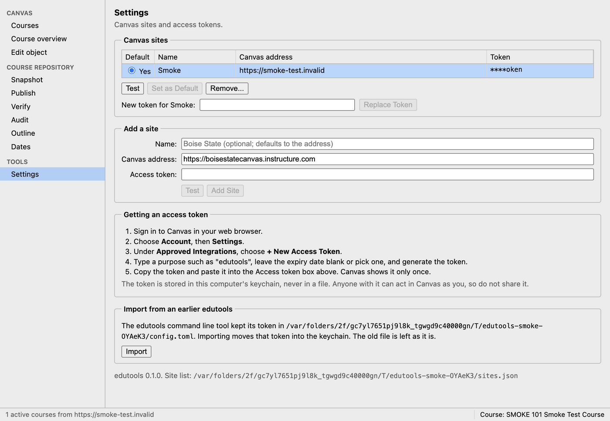

1. Under **Add a site**, give the site a **Name** if you like, such as "Boise State".
   If you leave it blank, edutools names it after the address, as in
   `boisestatecanvas.instructure.com`.
2. Check the **Canvas address**. It starts filled in with
   `https://boisestatecanvas.instructure.com`; change it if your Canvas lives somewhere
   else. It must start with `https://`.
3. Paste the token into **Access token**.
4. Choose **Test**. A working token says
   "Connected to https://...: N active courses."
5. Choose **Add Site**. The app says
   "Site added. The token is saved in this computer's keychain."

The first site you add becomes the default. The **Courses** screen always shows the
courses on the default site. If you work in more than one Canvas, add each one, then
select a site in the **Canvas sites** list and choose **Set as Default** to switch.
Switching sites closes the current course, because a course belongs to one site.

### Where your token is kept

The token is stored in your computer's keychain (the macOS Keychain, or the Windows
Credential Manager), never in a file, and the app never shows it again. The **Token**
column in **Canvas sites** shows only its last four characters, so you can tell which
token is saved without revealing it.

Choosing **Remove...** on a site deletes its token from this computer. The token itself
keeps working in Canvas until you delete it there, under **Approved Integrations**.

### Test a saved site

Select the site in **Canvas sites** and choose **Test**. This is the first thing to try
whenever the app cannot reach Canvas.

### Replace an expired token

Canvas tokens can expire, or be revoked. When that happens, the app shows an error
such as "Canvas API error 401" wherever it talks to Canvas.

1. Create a new token in Canvas, as above.
2. In **Settings**, select the site in **Canvas sites**.
3. Paste the new token into **New token for (site name):** and choose **Replace Token**.
   The app says "Saved a new token for (site name)."
4. Choose **Test** to confirm it works.

Everything else about the site stays as it was, including the course repositories the
app remembers for your courses.

### Import a token from the older edutools command line tool

If you used the edutools command line tool before, it kept its token in a file called
`config.toml`. Under **Import from an earlier edutools**, choose **Import**. The token
moves into the keychain, either as a new site or by updating a site that already uses
the same Canvas address. The old file is left where it is; delete it yourself once the
import works, since it holds the token in plain text.

If there is nothing to import, the app says "Nothing to import: no token found in ...".

## Open a course

Most screens work on one course at a time, called the **current course**. The status
bar at the bottom of the window always shows which course is current.

### Choose a course on Courses

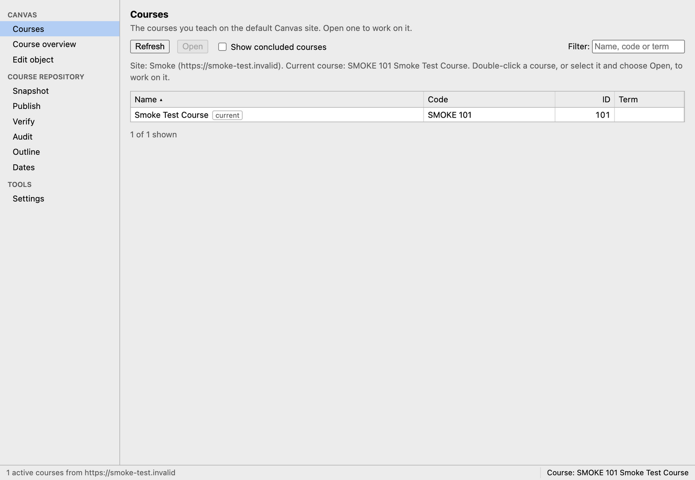

1. Choose **Courses** in the sidebar. It lists the courses you teach on the default
   site. Tick **Show concluded courses** to include past terms.
2. Type in **Filter** to narrow the list by name, code or term. Click a column heading
   to sort by it.
3. Double-click a course, or select it and choose **Open**.

The app opens the **Course overview** and remembers the course next time you start
edutools. The current course carries a **current** tag in the list.

If you open a screen before choosing a course, it shows **No course open** with a
**Go to Courses** button.

### Look at the course on Course overview

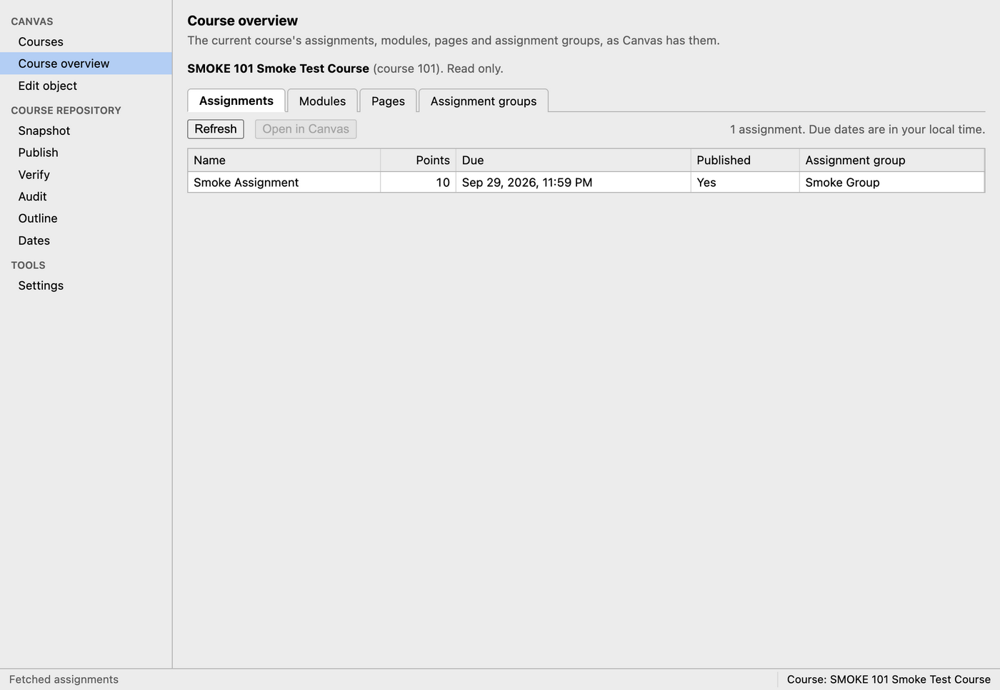

**Course overview** shows the course as Canvas has it right now, on four tabs:
**Assignments**, **Modules**, **Pages** and **Assignment groups**. It is read only.

- Select a row and choose **Open in Canvas** (or double-click it) to open that item in
  your web browser.
- Choose **Refresh** to see changes made in Canvas since the tab first loaded.
- Due dates are shown in your computer's time zone.
- The **Assignment groups** tab says whether the course weights the final grade by
  group, and what the weights add up to.

## Take a snapshot before you change anything

Before your first publish to a course, and before any big change, take a snapshot. It
is your backup.

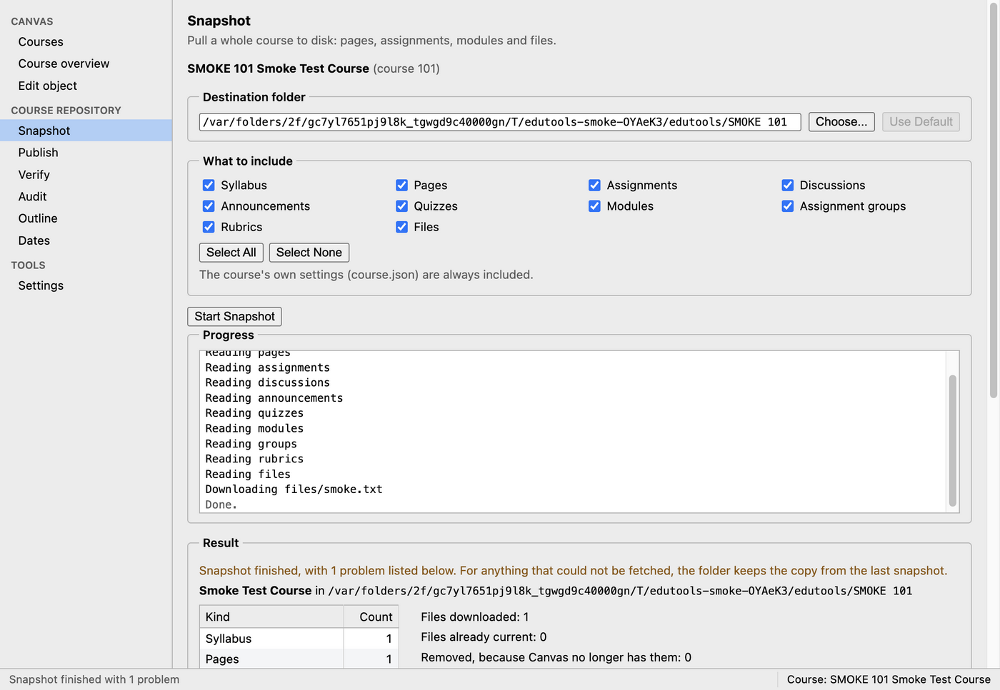

1. Open the course, then choose **Snapshot**.
2. Check the **Destination folder**. By default it is `Documents/edutools/` followed by
   the course code. Choose **Choose...** to put it elsewhere, or **Use Default** to go
   back.
3. Under **What to include**, leave everything ticked unless you only need part of the
   course.
4. Choose **Start Snapshot**, and watch the **Progress** log.
5. When it finishes, the **Result** lists how many of each kind it saved. Choose
   **Show in Finder** (or **Show in Explorer**) to open the folder.

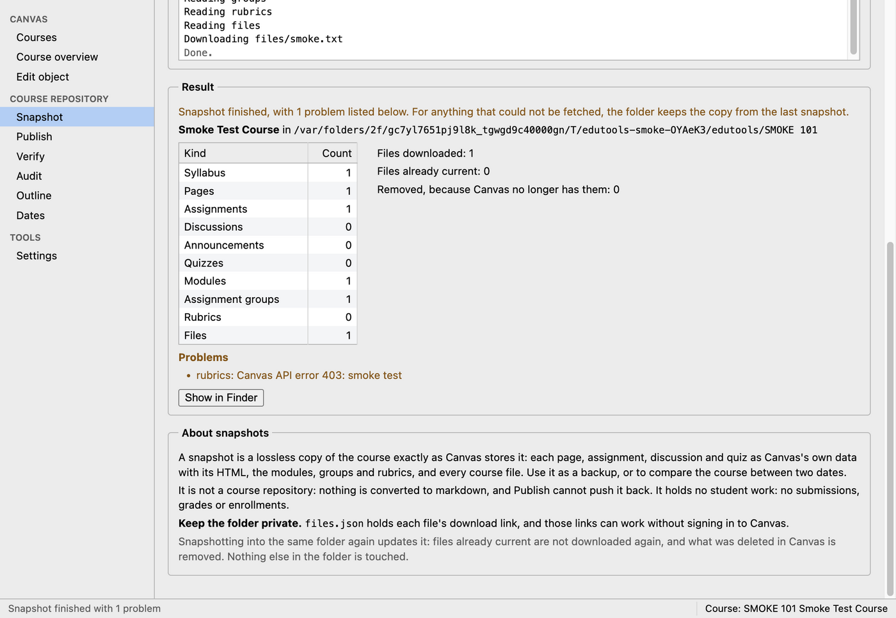

If something could not be fetched, the result lists it under **Problems**, and the
folder keeps the copy from the last snapshot for that part. A common one is rubrics,
which Canvas may not let every role read.

### What a snapshot is

- A complete copy of the course exactly as Canvas stores it: every page, assignment,
  discussion, announcement and quiz with its HTML, the modules, assignment groups and
  rubrics, the course settings, and every file in the course's Files area.
- A way to compare the course between two dates, or to recover the text of something
  you changed by mistake.
- Safe to repeat. Snapshotting into the same folder again updates it: files already
  current are not downloaded again, and what was deleted in Canvas is removed from the
  folder. Nothing else in the folder is touched.

### What a snapshot is not

- **It is not a course repository.** Nothing is converted to markdown, and Publish
  cannot push a snapshot back into Canvas. Restoring from a snapshot means copying text
  back by hand.
- **It holds no student work**: no submissions, grades or enrollments.
- **New Quizzes arrive without their questions.** A quiz built with New Quizzes is
  saved only as its assignment.
- **It is not self-contained yet.** Page and assignment bodies are saved exactly as
  Canvas holds them, so their images and links still point at Canvas addresses, not at
  the downloaded copies. Opened without a connection, or after the course is deleted,
  images in those pages will not show. Images that live outside the course's Files
  (another course, the instructor's own files, other websites, Canvas media
  recordings) are not downloaded at all. This is tracked as a planned improvement in
  [issue #11](https://github.com/shanep/edutools/issues/11).

**Keep the snapshot folder private.** Its `files.json` holds each file's download link,
and those links can work without signing in to Canvas.

## Set up the course repository

### What a course repository is

A **course repository** is a folder on your computer that holds the whole course as
text:

- one markdown (`.md`) file per page, assignment, discussion or quiz,
- a `syllabus.md` for the syllabus,
- an optional `canvas.css` for styling,
- any PDFs or data files to upload, and
- one settings file, `canvas.toml`, that describes the term, how due dates are worked
  out, the assignment groups and the modules.

Publishing turns each file into its Canvas object, works out every due date from
`canvas.toml`, and builds the modules. The repository is the source of truth: when the
course needs to change, you change the files and publish again.

edutools also keeps a small record in the repository, in
`.canvas/manifest-<course id>.json`, of which Canvas object each file became. It writes
this itself. Keep it with the rest of the folder, and do not edit it except when Audit
tells you to (see [Fix stale items](#fix-stale-items)).

The folder layout edutools expects by default, and how to change it, is in the README
under [Course repository layout](../README.md#course-repository-layout).

### Choose the repository in the app

Every screen in the **Course repository** group of the sidebar starts with a
**Course repository** box.

1. Open the course first.
2. On **Outline**, **Dates**, **Publish**, **Verify** or **Audit**, choose
   **Choose Folder...**.
3. Pick the folder that contains `canvas.toml`.

edutools remembers the folder for this course, so you choose it once. The box then
shows the folder, the number of weeks and the course's time zone. **Choose Another...**
switches to a different folder, **Refresh** re-reads `canvas.toml` after you edit it,
and **Forget** clears the choice.

If you pick a folder with no `canvas.toml`, the app says so and does not remember it.
If `canvas.toml` has a mistake, the app shows the problem in red; fix the file and
choose **Refresh**.

### A tour of canvas.toml

`canvas.toml` is a plain text file in a format called TOML. Sections start with a name
in square brackets, and each setting is `name = value`. Text goes in double quotes,
dates are written `2026-08-24`, and lines starting with `#` are comments. The README
has the full reference; this is the part a designer edits most.

#### Term dates

The `[term]` section is the skeleton every date is computed from. Rolling a course to
a new semester is mostly a matter of changing these dates.

```toml
[term]
timezone = "America/Boise"             # every due time is in this zone
first_monday = 2026-08-24              # the Monday of week 1 (must be a Monday)
weeks = 15                             # teaching weeks
break_after_week = 12                  # optional: a break week after week 12
last_day_of_instruction = 2026-12-11
finals_start = 2026-12-14
finals_end = 2026-12-18
total_points = 1000                    # what all gradable items should add up to
```

A break week is skipped when counting weeks, so week 13 starts the Monday after the
break. Set `total_points = 0` for a course graded by weighted groups rather than a
points total; see [Point totals](../README.md#point-totals).

#### Date policies

Each kind of gradable item (`lab`, `project`, `extra`, `quiz`, `discussion`, `exam`,
`reminder`) gets a policy saying when, within its week, it opens and is due:

```toml
[term.policy.lab]
unlock = "mon 00:00"     # optional: Canvas's "Available from"
due = "sun 23:59"        # required
grace_days = 2           # days between the due date and when it locks ("Until")
```

Which week an item belongs to, and its points, come from a bold line near the top of
its markdown file:

```markdown
# Lab 3: Writing Tests

**Week 3 · 30 points**
```

For a finals-week item, write `**Finals week · 150 points**`. The dot is a middle dot
(`·`). Every gradable file needs this line; the Dates screen tells you which ones are
missing it.

To give one file different timing from the rest of its kind, add an override named by
its path:

```toml
[override."assignments/lab-03.md"]
due = "wed 23:59"
```

More detail is in the README under [Date policies](../README.md#date-policies).

#### Modules

Each `[[module]]` section (note the double brackets) becomes one Canvas module, in the
order written.

```toml
[[module]]
title = "Module 5: Authentication and Credentials"
week  = 5
page  = "notes/week-05-overview.md"
items = [
    { header = "Due by Thursday at 11:59 p.m. Mountain Time" },
    "notes/week-05-authentication-and-credentials.md",
    "discussions/d03-authentication-policy-critique.md",
    { header = "Due by Sunday at 11:59 p.m. Mountain Time" },
    { quiz = 393733, title = "5.04 Survey" },
]
```

- `page` is the module's overview page, and `items` are the files it holds, in order.
  Paths are relative to `canvas.toml` and always use forward slashes, on Windows too.
- `week = 5` adds the week's dates to the title, so Canvas shows
  "Module 5: Authentication and Credentials (February 8 - February 14)". The dates
  follow the term, so you never retype them. Use `week = "finals"` for finals week.
- `{ header = "..." }` adds a text header inside the module.
- A **native item** is something built in Canvas with no file in the repository, such
  as an exam quiz. Name it by its Canvas id (from the address bar in Canvas, or from
  Audit) with one of `page` (by its url slug), `assignment`, `discussion`, `quiz` or
  `file`, plus an optional `title`. Put it in `items` to place it among the files, or
  in a `canvas = [ ... ]` list to add it after them.

Each publish rebuilds a module from this list, so anything added to the module by hand
in Canvas and not named here is dropped. If you add something to a module in Canvas,
add it to `canvas.toml` too.

A gradable file that no module lists is still published, but students will not find
it, so Publish warns about each one.

#### Instructor-only and always-visible modules

```toml
[[module]]
title = "Instructor Resources"
never_publish = true
page = "modules/instructor.md"
```

`never_publish = true` keeps a module and everything in it hidden from students on
every publish, even if someone publishes it in Canvas by hand in between. It also
leaves the module out of the Outline.

`publish = true` is the opposite, for a module every student needs from day one, such
as Course Resources: the module and everything in it are published on every publish,
whether or not you ticked Publish. If a file is in both kinds of module, it stays
hidden.

More detail is in the README under [Modules](../README.md#modules).

#### Assignment groups

```toml
[[group]]
name   = "Exams"
weight = 50

[[group]]
name   = "Labs"
weight = 50
kinds  = ["lab"]
```

Groups are created in the order written, and each kind of item is filed into the group
that lists it. As soon as any group has a `weight`, the course is set to weight the
final grade by group. Leave `weight` out of a group whose weight you manage by hand in
Canvas, and publishing will not touch it. Groups are matched by name, so renaming one
here creates a second group rather than renaming the first. See
[Assignment groups](../README.md#assignment-groups).

#### Heading icons

```toml
[icons]
"learning objectives"   = "icons/list.svg"
"due by *"              = "icons/task.svg"
```

Each heading whose text matches (ignoring case, with `*` as a wildcard) gets that
image in front of it, uploaded to the course's files. See
[Heading icons](../README.md#heading-icons).

#### Drafts

To keep a half-written file in the repository without it reaching Canvas, start the
file with:

```markdown
---
draft: true
---
```

A draft is not published, gets no due date, and is left out of its module. Turning an
already-published file into a draft does not delete it from Canvas: Publish lists it
as orphaned, and deleting it is up to you, since an assignment may already have
submissions. See [Drafts](../README.md#drafts).

Other things you can set in a file, such as submission types and pass/fail grading,
are in the README under
[Submission and grading types](../README.md#submission-and-grading-types).

## Check your work before publishing

Two screens show what a publish will do, without asking Canvas anything and without
changing anything. Use them every time you edit `canvas.toml`.

### Outline: the modules a publish will build

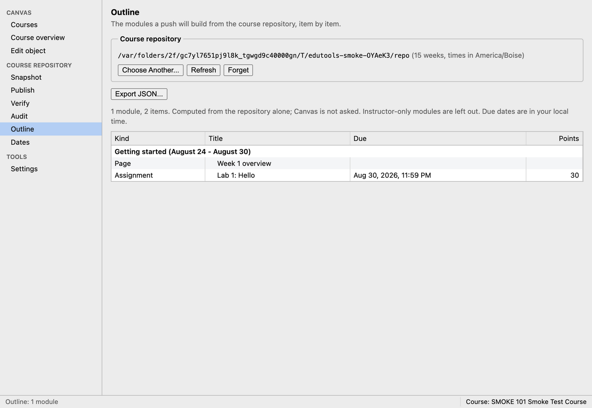

**Outline** lists every module, item by item, with each item's kind, due date and
points, exactly as a publish will build them. Instructor-only (`never_publish`)
modules are left out. Due dates are shown in your computer's time zone.

Check that every week has the items you expect, in the order you expect, and that no
module says **No items.** by mistake. **Export JSON...** saves the outline as a file,
which a course website can use to show a schedule that matches Canvas.

### Dates: the semester's schedule

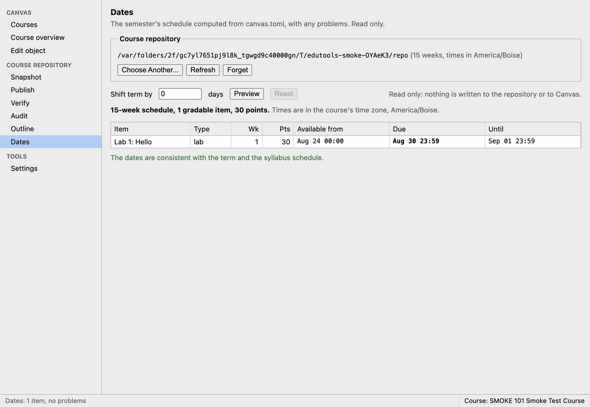

**Dates** lists every gradable item with its week, points, and its **Available from**,
**Due** and **Until** dates, in the course's time zone. Above the table it gives the
number of weeks, items and total points.

Below the table, a green line reads "The dates are consistent with the term and the
syllabus schedule." when all is well. Otherwise it lists each problem, such as:

- an item that is due, or opens, during the break week,
- an item that locks after the last day of instruction,
- dates out of order for one item (for example, due after it locks),
- the points adding up to something other than `total_points`, or
- the week dates in `syllabus.md`'s schedule table disagreeing with `canvas.toml`.

Fix these in the files and choose **Refresh** in the **Course repository** box.

### Preview a term shift

When rolling a course to a new semester, you can see the whole term moved before you
change a date:

1. Type a number of days in **Shift term by**, for example `7` or `-3`.
2. Choose **Preview**. The table shows every date moved, with a note that it is a
   preview only.
3. Choose **Reset** to go back.

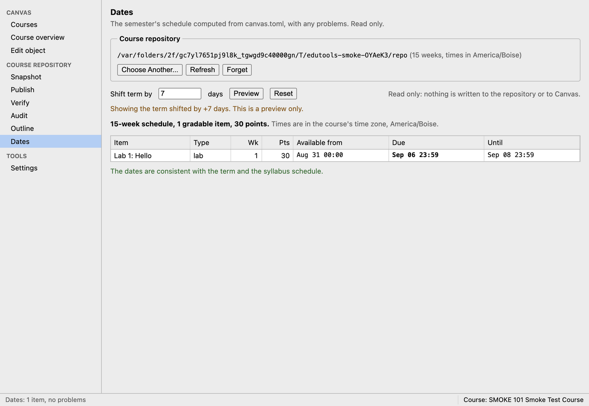

The shift is read only: nothing is written to the repository or to Canvas. To actually
move the term, change `first_monday` and the other `[term]` dates in `canvas.toml`.

## Publish a week's changes

**Publish** pushes the course repository into Canvas. It always works in two steps:
**1. Preview**, which writes nothing, then **2. Publish to Canvas...**. The Publish
button stays greyed out until a preview with exactly the same options has come back
clean.

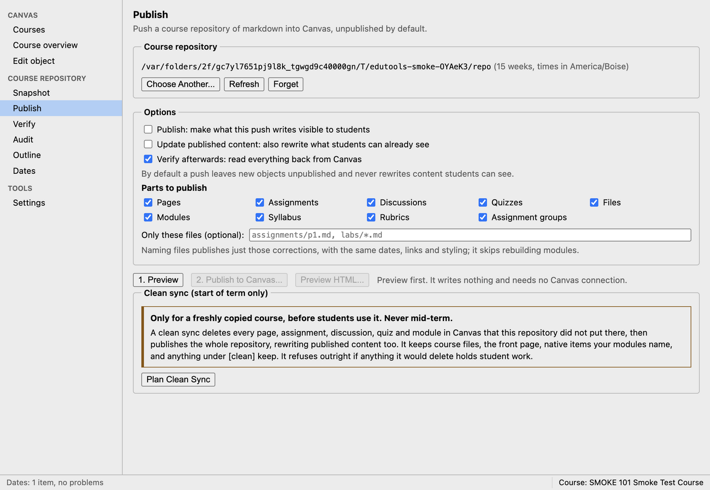

### The options, and the safe defaults

- **Publish: make what this push writes visible to students** is off by default. With
  it off, anything new is created unpublished, and anything that already exists keeps
  whatever visibility it has. Nothing is ever hidden by leaving it off. Turn it on only
  when you want students to see the result the moment it is written; the app asks you
  to confirm. Most designers leave it off and publish items one at a time in Canvas, or
  with [Edit object](#make-a-one-off-change-with-edit-object), when they are ready.
- **Update published content: also rewrite what students can already see** is off by
  default. See [Why published content is protected](#why-published-content-is-protected).
- **Verify afterwards: read everything back from Canvas** is on by default. Leave it
  on; see [Verify](#verify-did-it-arrive-intact).
- **Parts to publish** lists Pages, Assignments, Discussions, Quizzes, Files, Modules,
  Syllabus, Rubrics and Assignment groups. All are ticked; untick a part to leave it out
  of this publish.
- **Only these files (optional)** limits the publish to particular files. See
  [Push one correction](#push-one-correction).

The line under the checkboxes says it plainly: "By default a push leaves new objects
unpublished and never rewrites content students can see."

### Step 1: Preview

Choose **1. Preview**. It renders every file just as a publish would, but writes
nothing and does not even need a Canvas connection.

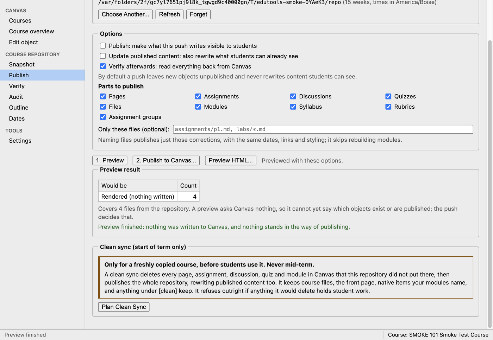

The **Preview result** tells you:

- **Rendered (nothing written)**: how many objects it prepared, and
  "Covers N files from the repository".
- A green "Preview finished: nothing was written to Canvas, and nothing stands in the
  way of publishing." when it is clean.
- Otherwise, a red list of problems with "Fix these in the repository before
  publishing." Each problem names the file. Fix them, then preview again.

It may also show:

- **gradable items in no module**: files that would be published but that students
  cannot reach, because no `[[module]]` lists them.
- **Links that could not be pointed at a Canvas object**: a link from one repository
  file to another that edutools could not match to anything in Canvas, often because
  the target is a draft, misspelled, or left out of this publish.
- **canvas.css uses properties Canvas will not store**: styling that Canvas would
  silently throw away. Take those properties out of `canvas.css`.
- **Drafts, not published**: files marked `draft: true`.

A preview cannot tell which objects already exist or are published; only the real
publish asks Canvas that.

**Preview HTML...** saves each rendered page as an HTML file in a folder you choose and
opens that folder, so you can look at them in a browser before anything reaches
Canvas.

If you change any option after previewing, the result is labelled "(options changed
since; preview again)" and the Publish button greys out until you do.

### Step 2: Publish to Canvas

1. Choose **2. Publish to Canvas...**.
2. Read the confirmation. It repeats what you chose, for example "New objects stay
   unpublished; existing visibility is unchanged." and "Content students can already
   see is left alone."
3. Choose **OK**. The **Progress** log shows each step.

When it finishes, the **Publish result** shows how many objects were **Created**,
**Updated** and **Skipped**, and a green line such as "Published to Canvas. New objects
are unpublished; existing visibility is unchanged." With **Verify afterwards** on, the
result ends with a **Verify afterwards** box.

After a publish, the next one needs a fresh preview, because Canvas has changed.

### Why published content is protected

If a page or assignment is already published, students may be reading it or partway
through working on it. Changing it under them is usually worse than leaving it as it
was. So by default a publish skips every published page, assignment, discussion, quiz
and module, and lists them in the result:

> N published objects left untouched, because students can already see them. "Update
> published content" would rewrite them:

When you do need to change something students can see (a wrong due date, a broken
link), tick **Update published content**. The app asks you to confirm. Combine it with
the file filter below so only that one item is rewritten. Updating a published item
leaves it published.

Instructor-only (`never_publish`) modules are the one exception: if anything in them
was published by hand, a publish hides it again.

### Push one correction

To fix one assignment without touching the rest of the course:

1. Edit the file in the repository.
2. On **Publish**, type its path in **Only these files (optional)**, for example
   `assignments/lab-03.md`. Separate several with commas. `*` works as a wildcard, as in
   `assignments/lab-*.md`. Use forward slashes, on Windows too.
3. If students can already see it, tick **Update published content**.
4. Choose **1. Preview**, check that it covers only that file, then
   **2. Publish to Canvas...**.

The file gets the same dates, links and styling as a full publish. Modules are not
rebuilt, since a correction is not a change of structure. If a path matches no file,
the app says so and lists files it could match. See
[Pushing one correction](../README.md#pushing-one-correction).

## Clean sync at the start of a term

A course copied from a template shell, or from last term, is full of things your
repository did not make: placeholder pages, last term's assignments. A **clean sync**
removes them, then publishes the whole repository, so the course becomes exactly the
repository.

**Only use it on a freshly copied course, before students use it. Never mid-term.**

A clean sync deletes every page, assignment, discussion, quiz and module in Canvas
that the repository did not put there. It keeps course files, the front page, native
items your modules name, and anything you list under `[clean] keep` in `canvas.toml`:

```toml
[clean]
keep = [{ quiz = 393731 }, { page = "welcome" }]
```

It then publishes the whole repository, rewriting published content too, and verifies
it. Whether the result is visible to students follows the **Publish** checkbox in
**Options** above.

1. On **Publish**, scroll to **Clean sync (start of term only)** and choose
   **Plan Clean Sync**. This reads the whole course and deletes nothing.
2. Read the plan. It lists **Would delete N objects**, any stale manifest entries it
   would forget, and how many items it keeps.
3. If you are sure, type the course code shown (as in "Type CS 101 to confirm:"). It is
   the course code from the Courses list, or the course id if the course has no code.
4. Choose **Delete and Publish Everything...**, and confirm. This cannot be undone.

A plan is used once. To run another clean sync, plan it again.

### When it refuses

If anything it would delete holds student work (an assignment or quiz with
submissions, or a discussion with posts), the plan says:

> This clean sync cannot run. Students have already used this course, so it is not a
> fresh copy:

followed by each item and why, for example `assignment "Lab 1" has submissions`.
There is no override, on purpose: deleting a graded item deletes its grades. Either
delete those items by hand in Canvas if you are certain, or keep them by adding them to
`[clean] keep`, then plan again. If a course has students working in it, you want a
normal publish, not a clean sync.

If the plan finds nothing to delete, it says "Nothing to clean: Canvas holds only what
the repository put there."

The README has more under
[Clean sync at the start of a term](../README.md#clean-sync-at-the-start-of-a-term).

## Check what landed: Verify and Audit

Canvas answers "OK" to every write, even when it has quietly stripped part of a page.
These two screens check what is really there. Both only read; neither changes
anything.

### Verify: did it arrive intact?

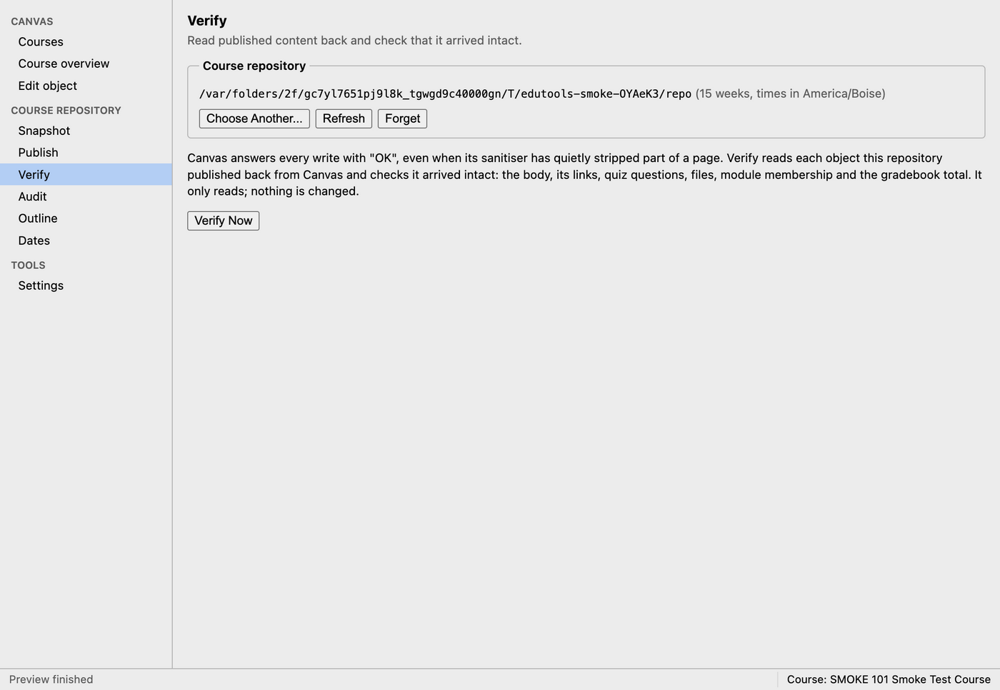

**Verify** reads back every object this repository has published and checks the body,
its links, quiz questions, files, module membership and the gradebook total. Choose
**Verify Now**.

- "All N objects verified against Canvas: each is there and intact." means you are
  done.
- Otherwise it lists each failure with the **Object** (the file), the **Check** that
  failed and the **Detail**. Usually the fix is in the file: styling Canvas does not
  allow, a link to something that was not published, a module missing an item. Fix it,
  publish again, and verify again.
- If it says "Nothing has been published from this repository to this course yet, so
  there is nothing to verify. Publish first.", that is exactly what it means.

Publish runs Verify for you when **Verify afterwards** is ticked. Run it on its own
after anyone has edited the course in Canvas.

### Audit: what differs between the repository and Canvas?

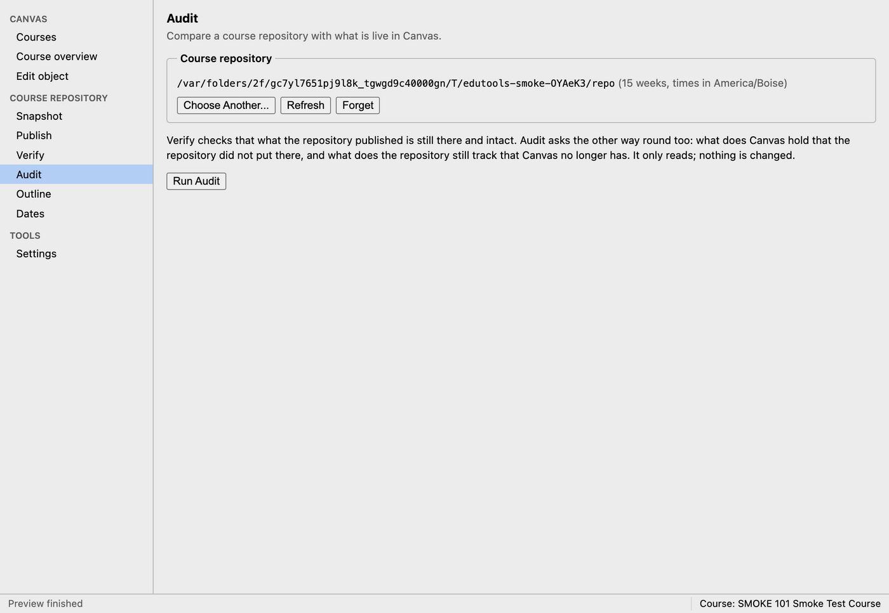

**Audit** compares both ways. Choose **Run Audit**. If all is well it says "The
repository and the course agree". Otherwise it sorts the differences into three kinds.

#### Fix stale items

**Stale: tracked, but gone from Canvas.** The repository's record says a file became a
Canvas object that no longer exists, usually because someone deleted it in Canvas.
This needs fixing before the next publish.

- If the deletion was a mistake, open `.canvas/manifest-<course id>.json` in the
  repository in a text editor, remove the entry for that file (the **Repo key** column
  names it), save, and publish again. The publish creates the object afresh.
- If the deletion was deliberate, delete the file from the repository (or mark it as a
  [draft](#drafts)) and remove it from its module in `canvas.toml`.

#### Untracked items are usually fine

**Untracked: in Canvas, not from the repository.** Things in the course that no file
made, such as a hand-built exam quiz or a file uploaded in Canvas. This is normal and
only reported. The one thing to watch: if an untracked item sits inside a module the
repository manages, the next publish drops it from that module. Name it in the
module's `items` or `canvas` list in `canvas.toml` to keep it.

#### Pending items will be created

**Pending: declared, not in Canvas yet.** Modules `canvas.toml` declares that Canvas
does not have yet. The next publish creates them. Nothing to do.

## Make a one-off change with Edit object

**Edit object** (under **Canvas** in the sidebar) changes a single page, assignment,
discussion, quiz or module directly in Canvas, without a repository. Use it for quick
fixes, for courses you do not manage from a repository, and for publishing items one at
a time when they are ready.

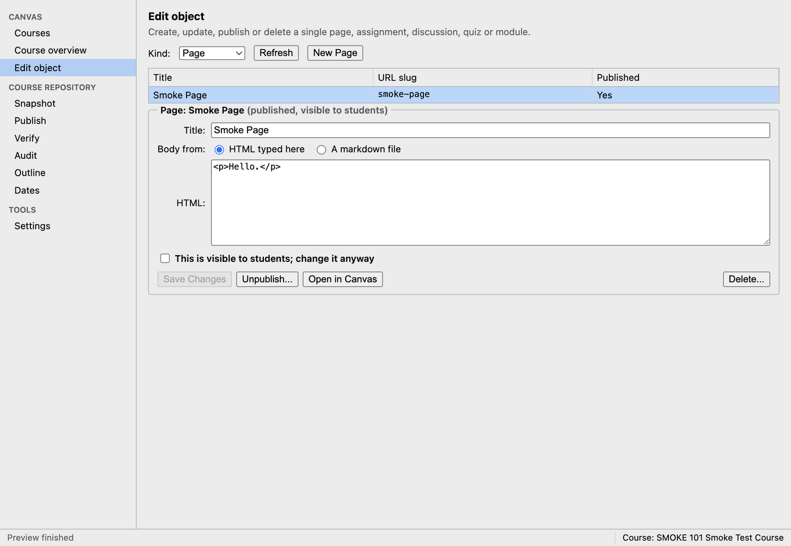

1. Choose the **Kind**: Page, Assignment, Discussion, Quiz or Module.
2. Select an item in the list to open it, or choose **New (kind)** to start a new one.
3. Change the **Title**, the body, and where the kind has them, **Points** and the
   **Available from**, **Due** and **Until** dates (in your computer's time zone;
   **Clear** empties a date). For the body, choose **HTML typed here**, or
   **A markdown file** and **Choose...** a file: it is converted the same way a publish
   converts it.
4. Choose **Save Changes** (or **Create (Unpublished)** for a new item). Only the fields
   you changed are sent.

Other buttons:

- **Publish...** and **Unpublish...** change whether students can see the item, after
  a confirmation.
- **Open in Canvas** opens it in your browser.
- **Delete...** deletes it, after a confirmation. Deleting an assignment, quiz or graded
  discussion also deletes every submission and grade on it, and cannot be undone.

### The published guard

When the item you open is published, the form shows
**This is visible to students; change it anyway**, and **Save Changes** stays greyed
out until you tick it. That is deliberate: it makes you stop and decide before changing
something a class may be reading. New items are always created unpublished.

### Hand edits to repository-managed items do not last

If the course has a repository chosen in the app and the item came from it, the form
warns: "The course repository manages this (kind) as (file). The next push overwrites
changes made here; edit the repository instead where you can."

Take that seriously. An edit made here to a repository-managed item is replaced the
next time that item is published from the repository. If you must fix something here
urgently, make the same change in the repository file too, so the next publish keeps
it. The warning only appears when the course's repository is chosen in the app, so an
item can be repository-managed even when you do not see it.

Two related points:

- Publishing a repository-managed item here means later publishes treat it as
  protected and skip it, unless you tick **Update published content**.
- Deleting a repository-managed item here leaves the repository's record pointing at
  it. Run [Audit](#fix-stale-items) afterwards; if it reports the item as stale, fix it
  as described there.

## Safety checklist

- **Snapshot first.** Take a snapshot before your first publish to a course and before
  any big change.
- **Always preview.** Read the preview result before choosing Publish to Canvas. The
  app will not let you skip it.
- **Leave Publish unticked** unless you want students to see the result immediately.
  New items arrive unpublished; you choose when they go live.
- **Leave Update published content unticked** unless you mean to change something
  students can already see, and then limit the publish to that one file.
- **Clean sync only on a fresh copy**, before students arrive. Never mid-term.
- **Deleting takes grades with it.** Deleting an assignment, quiz or graded discussion
  deletes its submissions and grades.
- **Edit the repository, not Canvas**, for anything the repository manages. Hand edits
  are overwritten by the next publish.
- **Check the course in the status bar** before any write. Make sure it is the course
  you mean.
- **Verify after publishing**, and Audit after anyone edits the course in Canvas.
- **Keep your token and snapshot folders private.**

## Troubleshooting

**"No Canvas site is set up. Add one in the app's Settings..."**
You have not added a Canvas site yet, or you removed the only one. See
[Add your Canvas site in Settings](#add-your-canvas-site-in-settings).

**"No token is saved for the site '...'."**
The site is listed but its token is missing from this computer's keychain, for example
after moving to a new computer. Paste a token into **New token for ...** and choose
**Replace Token**.

**"Canvas API error 401: ..."**
Canvas did not accept the token: it has expired or was deleted. See
[Replace an expired token](#replace-an-expired-token).

**"Canvas API error 403: ..."**
Your Canvas role is not allowed to do that in this course. In a snapshot this often
appears only for rubrics, and the rest of the snapshot is fine. Otherwise, check your
role in the course with your Canvas administrator.

**"Canvas API error 404: ..."**
Canvas could not find the course or item. It may have been deleted, or the current
course may be on a different site. Refresh the list, and check the course in the status
bar.

**An error on the Courses screen, with an Open Settings button.**
The status bar says "Could not fetch courses". Something is wrong with the connection
or the token; the red message says what. Choose **Open Settings**, select the site and
choose **Test** to try it again.

**"The Canvas address must start with https://"** or **"Not a valid URL"**
Type the full address, as in `https://boisestatecanvas.instructure.com`.

**"A site named '...' already exists."** or **"The site '...' already uses ..."**
You already added that site. To give it a new token, use **Replace Token** instead of
adding it again.

**"This folder has no canvas.toml, so it is not a course repository."**
You picked the wrong folder, often one level too high or too low. Choose the folder
that directly contains `canvas.toml`.

**"canvas.toml is not valid TOML (line N): ..."**
A typing mistake in `canvas.toml`, such as a missing quote or bracket, on or just
before line N. Fix it and choose **Refresh**.

**"canvas.toml has a problem: ..."**
The file reads fine, but a setting is wrong or missing. The message names it. Common
ones: "first_monday ... is a Tuesday, not a Monday", "no policy.lab in canvas.toml for
...", and "no '\*\*Week N · P points …\*\*' header line found", which means a gradable
file is missing its bold week and points line.

**"The course repository ... is not there any more. Choose it again."**
The folder was moved or renamed. Choose **Choose Folder...** and pick it in its new
place.

**"Preview these exact options first, and check the result, before publishing to Canvas."**
Options changed after the last preview. Choose **1. Preview** again.

**"No file in the repository matches ..."**
A path in **Only these files** is misspelled or uses backslashes. Use forward slashes
and check the spelling; the message lists files it could match.

**"A push is already running. Wait for it to finish before starting another."**
(or snapshot, verify, audit, clean sync). edutools does one Canvas job at a time,
because Canvas slows down and penalises parallel work. Wait for the first to finish.

**"The clean sync will not run, because students have used this course: ..."**
See [When it refuses](#when-it-refuses). There is no override.

**"The clean sync stopped: it could not delete ..."**
Something failed partway through deleting. The message lists what was already deleted.
Nothing was published. Choose **Plan Clean Sync** again to see what is left.

**"Type ... exactly to confirm the clean sync."**
The confirmation text must match the course code exactly, including spaces.

**"This is published, so students can see it. Tick 'This is visible to students; change it anyway' to save."**
Someone published the item in Canvas after you opened it. Decide whether to change it
while it is visible; if so, tick the box and save again.

**"Canvas would silently remove <style> ... from this body. Take it out first."**
Canvas strips some HTML without telling you. Remove that tag from the HTML or markdown.
Put styling in the repository's `canvas.css`, which edutools applies in a form Canvas
keeps.

**"Nothing has been published from this repository to this course yet..."** on Verify.
Publish first, then verify. Also check that the chosen repository is the right one for
this course.

**A publish result lists many items as "left untouched, because students can already see them".**
That is the protection working. If you really need to change one, see
[Push one correction](#push-one-correction).

**Something you added to a module in Canvas disappeared after a publish.**
The publish rebuilds each module from `canvas.toml`. Add the item to that module's
`items` or `canvas` list so the next publish keeps it.

**On a Mac, the app will not open and says it cannot be verified.**
See [Install on a Mac](#install-on-a-mac): use **Open Anyway** in
**System Settings > Privacy & Security**.
